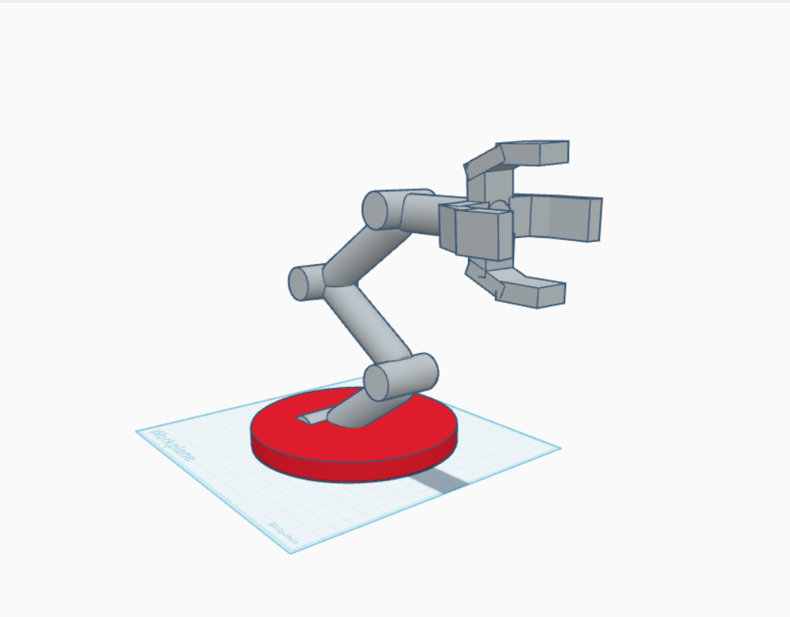

# 🤖 5-DOF Robotic Arm - 3D Design

This project is a **3D model of a 5 Degrees of Freedom (DOF) Robotic Arm** created using [Tinkercad](https://www.tinkercad.com/). It demonstrates basic industrial-style movement using five articulated joints.

## 🛠 Tool
- 💻 Tinkercad (3D Design)

## 🎯 Goal
Design a robotic arm with five realistic, movable joints.

## ⚙️ Degrees of Freedom
1. Base rotation  
2. Shoulder movement  
3. Elbow bend  
4. Wrist articulation  
5. Gripper open/close  

## 🖼 Preview
  

## 🔗 View Model
👉 [Tinkercad Link](https://www.tinkercad.com/things/11xaCaaAUX3-robotic-arm?sharecode=g3GlZatbxI0u7zmWy3p9_tIc1Fgwoe9MIKDmwrHafdA)
